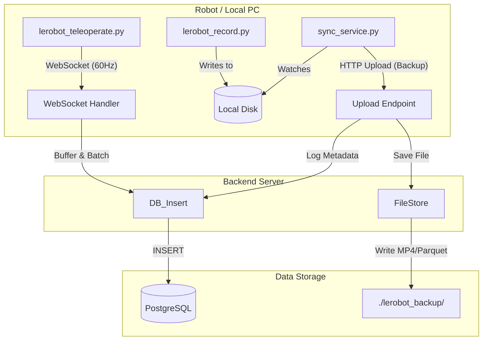
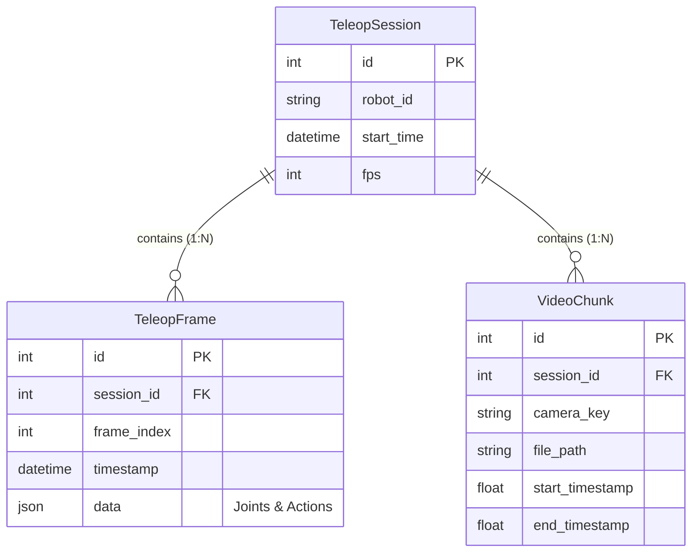

# LeRobot 백엔드 시스템 (Backend System)

이 폴더(`lerobot/backend`)는 로봇의 Teleoperation 데이터를 실시간으로 수집하고, DB에 저장하며, 나아가 AI 학습용 데이터셋으로 변환하는 기능을 담당합니다.

## 1. 시스템 아키텍처 (System Architecture)

### 1) 데이터 흐름도 (Data Flow Architecture)
로봇의 실시간 제어 데이터와 대용량 영상 데이터가 어떻게 처리되는지 보여줍니다.



### 2) 데이터베이스 구조 (ERD)
PostgreSQL에 저장되는 테이블 간의 관계입니다.



-   **데이터 흐름:**
    1.  `lerobot_teleoperate.py`: 로봇 제어 루프(60Hz)에서 WebSocket으로 데이터 전송
    2.  `app.py`: WebSocket으로 받은 데이터를 메모리 버퍼에 임시 저장
    3.  **Batch Insert**: 버퍼가 차면(예: 60개) 한 번에 DB에 저장 (IO 부하 감소)
    4.  `sync_service.py`: 로컬에 쌓인 데이터셋 파일을 감지하여 백그라운드에서 백업 전송

## 2. MSA 아키텍처 및 기술 선정 이유 (Architecture Decisions)

이 시스템은 **MSA (Microservices Architecture)** 철학을 따르며, 데이터의 특성에 따라 최적의 프로토콜을 분리하여 사용합니다.

### **1) 관절 데이터 (Telemetry Service)**
-   **프로토콜:** **WebSocket (TCP)**
-   **이유:**
    -   초당 60회(60Hz)의 빈번한 데이터 전송에는 오버헤드가 적은 WebSocket이 필수적입니다.
    -   TCP 기반이므로 **데이터 유실이 0%**임이 보장됩니다. (로봇 팔의 위치 데이터는 단 1개라도 빠지면 치명적입니다.)

### **2) 영상 데이터 (Video Ingestion Service)**
-   **프로토콜:** **HTTP Multipart Upload (Chunking)**
-   **왜 WebRTC를 쓰지 않는가?**
    -   **WebRTC (UDP)**는 '실시간 통화'를 위해 설계되었습니다. 네트워크가 느려지면 **화질을 뭉개거나 프레임을 버립니다(Drop).**
    -   **AI 학습(Imitation Learning)**을 위해서는 **단 한 프레임의 깨짐도 없는 원본 화질**이 필요합니다.
    -   따라서, 로봇에서 고화질로 녹화(Encoding)하고, 이를 파일 조각(Chunk)으로 나누어 **HTTP(TCP)**로 신뢰성 있게 서버로 전송하는 방식이 **데이터셋 구축에는 훨씬 적합**합니다.
    -   이것이 Tesla 등 대규모 데이터 수집 파이프라인에서 사용하는 **Store-and-Forward** 방식입니다.

## 3. 왜 60Hz 통신이 어려운가? (Why 60Hz?)

**60Hz**는 1초에 60번, 즉 **0.016초(16ms)** 마다 한 번씩 데이터를 보내야 함을 의미합니다.

-   **REST API (HTTP)**: 매번 연결을 맺고 끊는 오버헤드가 커서, 16ms 안에 처리가 불가능할 수 있습니다. (로봇이 버벅거림)
-   **WebSocket**: 한 번 연결된 '파이프'를 통해 데이터만 계속 흘려보내므로 오버헤드가 적어 60Hz 처리에 적합합니다.
-   **DB 부하 전략**: 1초에 60번 DB에 `INSERT` 쿼리를 날리면 DB가 뻗을 수 있습니다. 그래서 **Async Batching(메모리 버퍼링)** 전략을 사용하여, 1초치 데이터를 모아서 **1번만 INSERT** 하는 방식으로 해결했습니다.

## 3. 카메라 데이터(영상) 관리 전략 (Camera Data Strategy)

AI 학습에는 **관절 데이터(State/Action)** 관리를 위한 DB와, **대용량 영상(MP4)** 관리를 위한 파일 저장이 모두 필요합니다.
우리는 **"Sidecar Sync 패턴"**을 사용하여, 기존 LeRobot 코드를 건드리지 않으면서도 데이터를 중앙화합니다.

### **[Recommended] Sidecar Sync Pattern**
1.  **순정 사용 (Original)**:
    -   `lerobot_record.py` 등 기존 스크립트를 사용하여 로컬에 데이터셋을 자유롭게 생성합니다.
2.  **자동 동기화 (Auto Sync)**:
    -   `sync_service.py`를 실행해두면, 로컬 `outputs/` 폴더를 감시합니다.
    -   새로운 데이터셋(Parquet)과 영상 파일이 생성되면, **즉시 백엔드 서버로 백업**합니다.
    -   **중복 방지:** 업로드 완료된 파일은 `.uploaded` 마커를 생성하여 중복 전송을 방지합니다.

이 방식은 **LeRobot 원본 소스코드의 수정 없이(Zero-Modification)** 엔터프라이즈급 데이터 파이프라인을 구축할 수 있는 가장 안전한 방법입니다.

## 4. 백엔드 API (Backend API)
-   **Telemetry:** `WS /ws/log/{robot_id}` (60Hz 실시간 관절 데이터)
-   **Video Ingest:** `POST /upload/video` (실시간 Chunk 업로드)
-   **File Backup:** `POST /upload/sync` (데이터셋 파일 백업)

## 4. 실행 방법 (Usage)

### 1) 서버 실행
```bash
# lerobot/src 폴더에서
uvicorn lerobot.backend.app:app --host 0.0.0.0 --port 8000
```

### 2) 로봇 연결 (Teleoperation + Logging)
```bash
python lerobot/scripts/lerobot_teleoperate.py \
  --robot.type=so101_follower --robot.port=/dev/ttyACM0 \
  --teleop.type=so101_leader --teleop.port=/dev/ttyACM1 \
  --backend_url=ws://localhost:8000 \
  --robot_id=robot_A
```

### 3) 데이터셋 추출 (DB -> HF Dataset)
```bash
python lerobot/backend/export_to_dataset.py \
  --session_id 1 \
  --repo_id my-user/my-new-dataset
```
